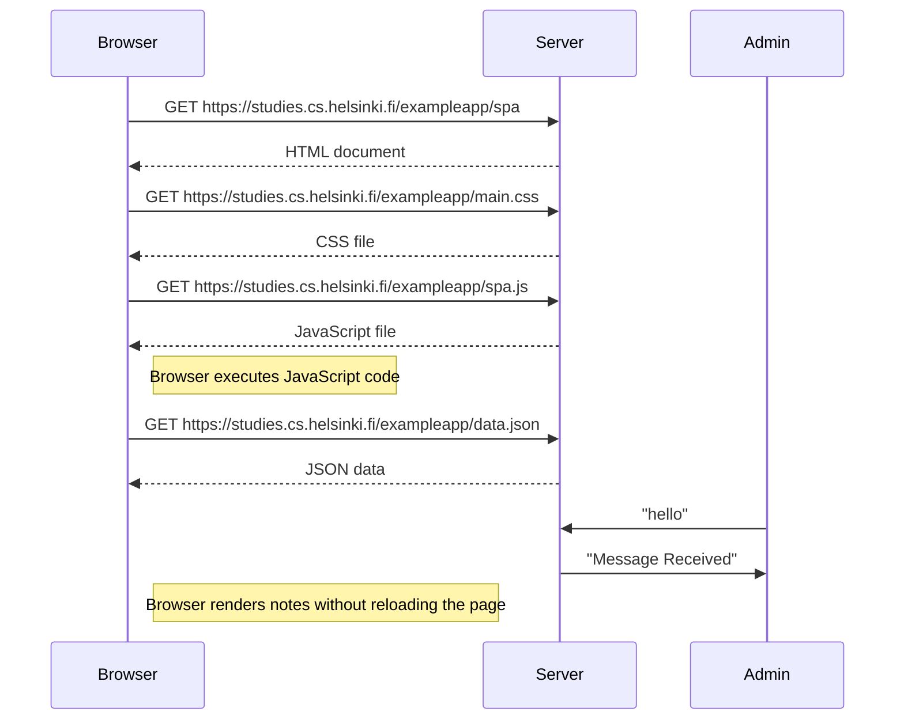

```mermaid
sequenceDiagram
    participant Browser
    participant Server
    participant Admin

    Browser->>Server: GET https://studies.cs.helsinki.fi/exampleapp/spa
    Server-->>Browser: HTML document

    Browser->>Server: GET https://studies.cs.helsinki.fi/exampleapp/main.css
    Server-->>Browser: CSS file

    Browser->>Server: GET https://studies.cs.helsinki.fi/exampleapp/spa.js
    Server-->>Browser: JavaScript file

    Note right of Browser: Browser executes JavaScript code

    Browser->>Server: GET https://studies.cs.helsinki.fi/exampleapp/data.json
    Server-->>Browser: JSON data

    Admin->>Server: "hello"
    Server->>Admin: "Message Received"

    Note right of Browser: Browser renders notes without reloading the page
```
